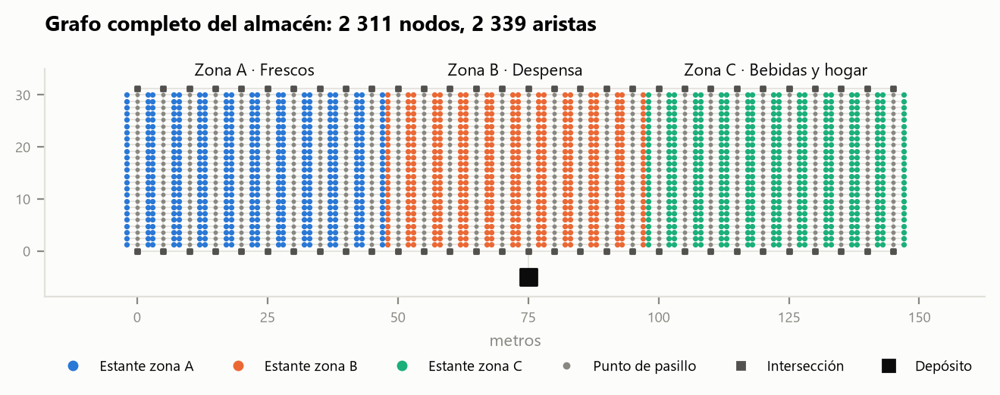

# SmartPick

Optimización de rutas de *picking* en almacenes inteligentes mediante grafos.

Trabajo del curso **1ACC0184 Complejidad Algorítmica (2026-20)**, Grupo 2, Caso de
estudio 2: *Gestión de almacenes inteligentes*.

| Integrante | Código |
| --- | --- |
| Palma de los Santos, Elynor Mikela | U20241A972 |
| Flores Pinchi, José Fernando | U20241A290 |
| Julca Cruz, Renso Anthony | U202121579 |



## Qué hace

1. Toma productos y pedidos **reales** del dataset público de Instacart.
2. Guarda los 1 500 productos más pedidos en un almacén de 3 zonas y 30 pasillos.
3. Modela el almacén como un grafo de **2 311 nodos** (estantes, pasillos,
   intersecciones y depósito) con aristas pesadas en metros.
4. Genera las figuras y estadísticas del informe.

El contexto completo del proyecto (entregas, rúbrica, modelo y técnicas) está en
[docs/CONTEXTO.md](docs/CONTEXTO.md). Las reglas de trabajo, en
[CONTRIBUTING.md](CONTRIBUTING.md).

## Instalación

Se necesita Python 3.12 o superior. Desde la carpeta del proyecto, en la terminal de
VS Code:

```
python -m venv .venv
.venv\Scripts\pip install -r requirements.txt
git config core.hooksPath .githooks
```

La última línea activa el control de mensajes de commit (ver CONTRIBUTING).

## Uso

Los datos ya procesados están en `data/processed/`, así que se puede ir directo a
las figuras:

```
.venv\Scripts\python src/visualizar.py
```

Para regenerar todo desde los CSV originales (ver [data/raw/README.md](data/raw/README.md)):

```
.venv\Scripts\python src/dataset.py
.venv\Scripts\python src/grafo.py
.venv\Scripts\python src/visualizar.py
```

## Estructura

```
smartpick/
├── data/
│   ├── raw/            CSV originales de Instacart (no se suben)
│   └── processed/      productos, pedidos, nodos y aristas del almacén
├── src/
│   ├── config.py       parámetros del almacén: pasillos, distancias, zonas
│   ├── dataset.py      Instacart -> productos y pedidos del almacén
│   ├── grafo.py        productos -> grafo del almacén (nodos.csv, aristas.csv)
│   └── visualizar.py   grafo -> figuras y estadísticas
├── figuras/            imágenes y tablas para el informe
└── docs/               contexto del proyecto
```

## Datos

Instacart. (2017). *The Instacart Online Grocery Shopping Dataset 2017* [Data set].
Kaggle. <https://www.kaggle.com/datasets/psparks/instacart-market-basket-analysis>
